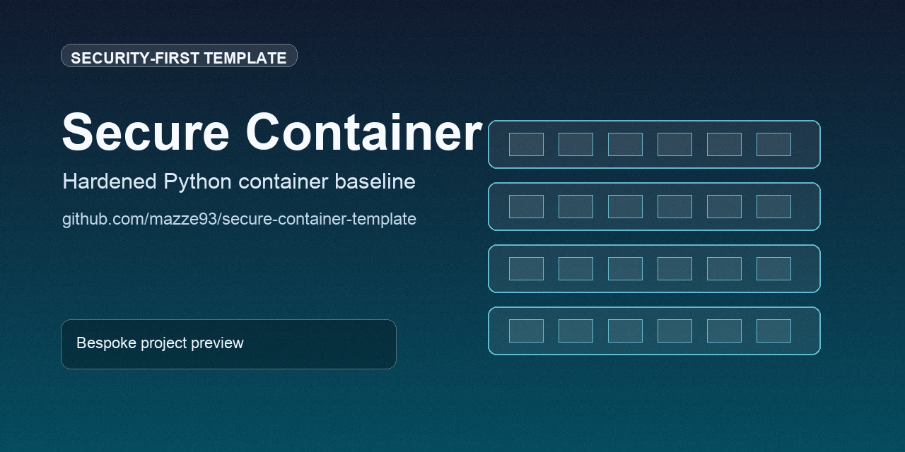

# secure-container-template




A hardened Python container baseline with CI-backed security gates, signed release artifacts, and practical defaults for production-minded teams.

## At a glance
- Non-root runtime and health contract checks.
- Local policy checks with Hadolint + Trivy (no external scanner secrets).
- SARIF upload to GitHub code scanning for Dockerfile and image findings.
- Keyless cosign signing and verification for published images.
- Dependabot patch/minor auto-approval and auto-merge policy.
- SBOM + provenance attestations on pushed images.

## Quick links
- [Repository Layout](#repository-layout)
- [Local Development](#local-development)
- [CI and Security Gates](#ci-and-security-gates)
- [Image Signing](#image-signing)
- [Dependabot Policy](#dependabot-policy)
- [Release Ritual](#release-ritual)

## GitHub social preview
Upload `.github/social-preview.png` in repository `Settings -> General -> Social preview` to use the branded card on link shares.

## Repository Layout

```text
.
├── .github/
│   ├── dependabot.yml
│   └── workflows/
│       ├── ci.yml
│       ├── dependabot-auto-merge.yml
│       └── release.yml
├── src/
├── tests/
├── .trivy.yaml
├── CHANGELOG.md
├── Dockerfile
├── LICENSE
├── VERSION
├── build.sh
├── requirements-dev.txt
├── requirements.txt
└── test.sh
```

## Local Development

Run the test suite:

```bash
./test.sh
```

Build the container:

```bash
./build.sh
```

Run the service locally:

```bash
python3 -m venv .venv
source .venv/bin/activate
python -m pip install -r requirements.txt
python -m src.main
```

The health endpoint is available at `http://127.0.0.1:8000/health`.

## CI and Security Gates

The main workflow in [.github/workflows/ci.yml](.github/workflows/ci.yml) enforces:

- Python tests must pass.
- The `Dockerfile` must declare a non-root `USER`.
- Hadolint policy checks must pass for `Dockerfile`.
- The built image must have a non-root `Config.User`.
- The container must answer `/health` with `{"status":"ok"}`.
- Trivy fails CI on fixable `HIGH`/`CRITICAL` vulnerabilities.
- Hadolint and Trivy SARIF reports are uploaded to GitHub code scanning.
- Images published from `main` include SBOM and provenance attestations.

Security policy here is secretless and vendor-neutral for scanning. No Docker Hub credentials or third-party scanner accounts are required.

## Image Signing

On publish-eligible runs, CI signs the pushed GHCR image digest with keyless cosign and then verifies the signature in the same workflow:

- Signing identity: GitHub Actions OIDC (`token.actions.githubusercontent.com`)
- Signed artifact: `ghcr.io/<owner>/<repo>@<digest>`
- Verification requires certificate issuer and workflow identity match

This creates an auditable chain from source workflow to released image.

## Dependabot Policy

Dependabot updates are configured in [.github/dependabot.yml](.github/dependabot.yml), and safe updates are automated by [.github/workflows/dependabot-auto-merge.yml](.github/workflows/dependabot-auto-merge.yml):

- Scope: `pip` and `github-actions`
- Auto-approve: semver `patch` and `minor` updates only
- Auto-merge: enabled after approval and branch protection checks pass
- Major upgrades remain manual review

If repository auto-merge is disabled, the workflow warns and leaves the PR for manual merge.

## Branch Protection

`main` should require the `test_and_container` status check before merge.

Recommended settings for `main`:

- Require a pull request before merging
- Require at least 1 approval
- Require status checks to pass before merging
- Require branches to be up to date before merging
- Required check: `test_and_container`
- Require conversation resolution before merging
- Apply rules to administrators

Equivalent GitHub CLI call:

```bash
gh api --method PUT \
  -H "Accept: application/vnd.github+json" \
  /repos/mazze93/secure-container-template/branches/main/protection \
  --input - <<'JSON'
{
  "required_status_checks": {
    "strict": true,
    "contexts": ["test_and_container"]
  },
  "enforce_admins": true,
  "required_pull_request_reviews": {
    "dismiss_stale_reviews": true,
    "require_code_owner_reviews": false,
    "required_approving_review_count": 1
  },
  "restrictions": null,
  "required_conversation_resolution": true,
  "allow_force_pushes": false,
  "allow_deletions": false,
  "block_creations": false,
  "required_linear_history": false,
  "lock_branch": false,
  "allow_fork_syncing": true
}
JSON
```

## Release Ritual

The repository follows SemVer. Releases are created from Git tags matching `v*.*.*`.

To ship a new release:

```bash
echo "0.1.1" > VERSION
```

Update [CHANGELOG.md](CHANGELOG.md), then:

```bash
git add VERSION CHANGELOG.md
git commit -m "release: v0.1.1"
git tag v0.1.1
git push origin main --tags
```

Pushing the tag triggers [.github/workflows/release.yml](.github/workflows/release.yml), which creates the GitHub Release.
